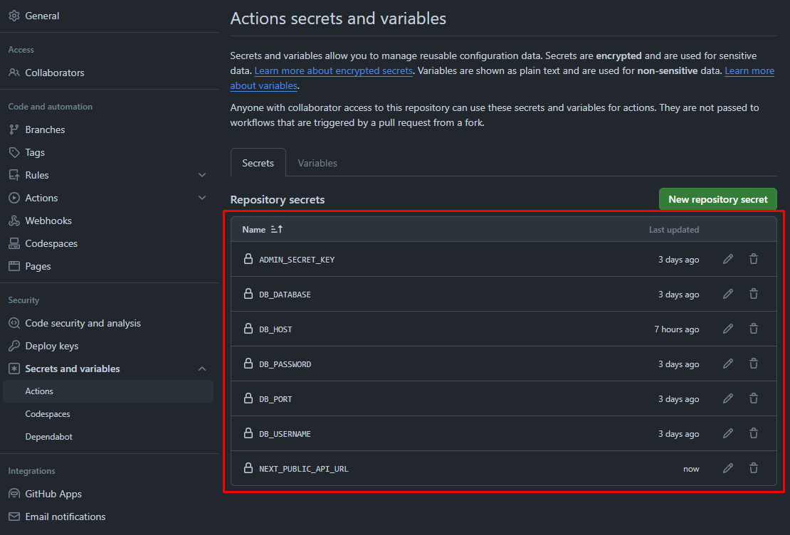

# Desktop version CI/CD pipeline integration guide

# [:us: English](#english) | [:es: Español](#español)

## English

We created an **automatic integration process** to be able to develop the webapp locally, push the changes to my GitHub repository and then apply the changes into a **production environment** using the AWS EC2 instance. This guide walks you through this process in order for it to be easily integrated into any new web application with similar features.

### Table of contents

1. [New DuckDNS domain](#new-duckdns-domain)
2. [Connecting EC2 to GitHub Actions Runners](#connecting-ec2-to-github-actions-runners)
3. [Configuring Nginx for HTTP](#configuring-nginx-for-http)
4. [Requesting SSL certificate](#requesting-ssl-certificate)

#### [Back to top](#ci-cd-pipeline-integration-guide)

### New DuckDNS domain

First things first, it is recommended to use [our AWS Cloudformation template](https://github.com/cmilsor245/plotscore/blob/main/.aws/cloudformation.yml) to create a new **AWS Stack**. This way you'll end up having all the resources needed to create our **desktop version** of the **plotscore project**.

This template will make sure you have an **EC2 instance**, a **Security Group**, an **Elastic IP Address** and a **RDS database instance**, all of them ready to use right away.

Once the AWS resources are created, you need to set up the domain name for our new web application. We will be using the domain name `plotscore--desktop.duckdns.org` in this guide.


#### [Back to english section](#english)

---

### Connecting EC2 to GitHub Actions Runners

The way the projects are connected between them and they work correctly is by using **environment variables** and **GitHub Actions secrets**, which makes it more secure in terms of using certain passwords and other credentials.

You now need to create those variables/secrets in the GitHub repository, just so [our GitHub Actions ***deploy*** workflow](https://github.com/cmilsor245/plotscore/blob/main/.github/workflows/deploy.yml) can use them to configure the app into a production environment inside your EC2 instance.



GitHub Actions needs to be able to connect to your EC2 instance in order to download the code inside the actual machine and deploy the projects. For that, you are going to need to create a new **GitHub Actions Runner**. To get the GitHub Runner connected to an specific machine, execute the next commands displayed in the Actions/Runners tab in the GitHub repository settings page:

> [!NOTE]
> Once the last highlighted command is executed, you'll only set the new runner's name and skip the rest of the options.


Without moving from the directory you are located in, use the command `sudo ./svc.sh install`, followed by the command `sudo ./svc.sh start` to make the Runner start automatically once a push to the repository is made.


Once the Runner is connected, you can make trigger a first build by pushing to the repository. The Runner will then get into Active mode and start using the GitHub Actions workflow to build and deploy the projects inside the EC2 instance.


After the build is done, go back to the EC2 terminal and execute the next commands one by one:

```bash
cd ~/actions-runner/_work/plotscore/plotscore

pm2 start ecosystem.config.js --only nextjs-app

pm2 start ecosystem.config.js --only laravel-app

pm2 save --force

pm2 startup
```

> [!NOTE]
> The last command will generate an additional command starting by 'sudo...'. You need to copy it and execute it to get PM2 running in the background automatically once the instance is launched.

#### [Back to english section](#english)

---

### Configuring Nginx for HTTP

The Cloudformation template made sure the EC2 machine has the needed resources for you to be able to configure Nginx as the main WebApp Server and make it secure by using HTTPS later.

Before getting the HTTPS protocol working, you need the webpage to work with HTTP. To achieve so, execute the next command to create a new Nginx configuration file:

`sudo nano /etc/nginx/sites-available/plotscore`

Add the next content to it:

```bash
server {
  listen 80;
  server_name plotscore--desktop.duckdns.org;

  location / {
    proxy_pass http://localhost:3000;
    proxy_http_version 1.1;
    proxy_set_header Upgrade $http_upgrade;
    proxy_set_header Connection 'upgrade';
    proxy_set_header Host $host;
    proxy_cache_bypass $http_upgrade;
  }

  location /api/ {
    proxy_pass http://localhost:8000;
  }
}
```

Execute the next commands to enable the new configuration:

```bash
sudo ln -s /etc/nginx/sites-available/plotscore /etc/nginx/sites-enabled/

sudo nginx -t

sudo systemctl restart nginx
```

You can now access your new web application using the domain name `http://plotscore--desktop.duckdns.org`.

#### [Back to english section](#english)

---

### Requesting SSL certificate

You now have a fully accesible webpage using HTTP protocol. Now that the custom domain points to your EC2 machine and serves the Next.js project (which is internally connected to Laravel itself), you'd need to add a secure connection using SSL. To do so, execute the next command:

`sudo certbot certonly --nginx -d plotscore--desktop.duckdns.org`

Enter an email, agree to the terms and answer the last query. You now have a SSL certificate ready to be used in your web application. Open the Nginx configuration file again with the next command: `sudo nano /etc/nginx/sites-available/plotscore`. Remove all of the content inside and replace it with the next content:

```bash
server {
  listen 80;
  server_name plotscore--desktop.duckdns.org;

  return 301 https://$host$request_uri;
}

server {
  listen 443 ssl;
  server_name plotscore--desktop.duckdns.org;

  ssl_certificate /etc/letsencrypt/live/plotscore--desktop.duckdns.org/fullchain.pem;
  ssl_certificate_key /etc/letsencrypt/live/plotscore--desktop.duckdns.org/privkey.pem;

  location / {
    proxy_pass http://localhost:3000;
    proxy_http_version 1.1;
    proxy_set_header Upgrade $http_upgrade;
    proxy_set_header Connection 'upgrade';
    proxy_set_header Host $host;
    proxy_cache_bypass $http_upgrade;
  }

  location /api {
    proxy_pass http://localhost:8000;
    proxy_set_header Host $host;
    proxy_set_header X-Real-IP $remote_addr;
    proxy_set_header X-Forwarded-For $proxy_add_x_forwarded_for;
    proxy_set_header X-Forwarded-Proto $scheme;
  }
}
```

Restart Nginx: `sudo systemctl restart nginx`.

This configuration will make sure that your web application is accessible using HTTPS. Also, every user that tries to access your webpage using HTTP protocol will be automatically redirected to HTTPS.

You can now access your new secure web application using the domain name `https://plotscore--desktop.duckdns.org`.

#### [Back to english section](#english)

---

---

## Español

Hemos creado un **proceso automático de integración** para poder desarrollar las nuevas funcionalidades de la web localmente, hacer push de los cambios hacia mi repositorio en GitHub y aplicar dichos cambios en la instancia AWS EC2 en un **entorno de producción**. Esta guía muestra los pasos para llegar a dicho punto para que pueda ser fácilmente integrado en cualquier aplicación web de las mismas características.

### Índice

1. [Nuevo dominio DuckDNS](#nuevo-dominio-duckdns)
2. [Conectar EC2 a GitHub Actions Runners](#conectar-ec2-a-github-actions-runners)
3. [Configurar Nginx para HTTP](#configurar-nginx-para-http)
4. [Solicitar certificado SSL](#solicitar-certificado-ssl)

#### [Volver arriba](#ci-cd-pipeline-integration-guide)

### Nuevo dominio DuckDNS

Primero, se recomienda utilizar [nuestra plantilla de AWS Cloudformation](https://github.com/cmilsor245/plotscore/blob/main/.aws/cloudformation.yml) para crear una nueva **AWS Stack**. Esto te permitirá tener todos los recursos necesarios para crear nuestra **versión desktop** del **proyecto plotscore**.

Dicha plantilla creará una **instancia EC2**, un **Grupo de Seguridad**, un **dirección IP Elástica** y una **instancia de base de datos RDS**. Todos estos recursos están listos para ser usados inmediatamente.

Una vez que se creen todos los recursos, es necesario configurar el dominio para nuestra nueva aplicación web. Para hacerlo, utilizaremos el dominio `plotscore--desktop.duckdns.org` en esta guía.


#### [Volver a la sección en español](#español)

---

### Conectar EC2 a GitHub Actions Runners

La manera de conectar los proyectos entre ellos y que funcionen correctamente es usando **variables de entorno** y **secrets de GitHub Actions**, lo que hace que sea más seguro.

Ahora necesitas crear esas variables/secrets en el repositorio de GitHub, de manera que [el GitHub Actions workflow para el ***despliegue***](https://github.com/cmilsor245/plotscore/blob/main/.github/workflows/deploy.yml) pueda usarlas para configurar la aplicación web en un entorno de producción dentro de tu instancia EC2.


GitHub Actions necesita poder conectarse a tu instancia EC2 para ser capaz de descargar el código dentro de la propia máquina y desplegar los proyectos. Para ello, necesitarás crear un nuevo **GitHub Actions Runner**. Para conseguir que un Runner se conecte a una máquina específica, ejecuta los siguientes comandos mostrados en la Pestaña de Actions en la página de configuración de repositorio de GitHub:

> [!NOTE]
> Una vez que el último comando se ejecute, solo tienes que establecer el nombre del nuevo Runner y saltar las opciones restantes.


Sin moverte del directorio donde te encuentras, usa el comando `sudo ./svc.sh install`, seguido del comando `sudo ./svc.sh start` para que el Runner se active automáticamente una vez que se realice un push en el repositorio.


Una vez el Runner está conectado, puedes generar el primer despliegue automático haciendo push en el repositorio. El Runner se encenderá y comenzará a usar el workflow de GitHub Actions para construir y desplegar los proyectos dentro de la instancia EC2.


Después de que el despliegue se complete, vuelve al terminal de EC2 y ejecuta los siguientes comandos:

```bash
cd ~/actions-runner/_work/plotscore/plotscore

pm2 start ecosystem.config.js --only nextjs-app

pm2 start ecosystem.config.js --only laravel-app

pm2 save --force

pm2 startup
```

> [!NOTE]
> El último comando generará un comando adicional que comienza por 'sudo...'. Copia dicho comando adicional y ejecúlo para que PM2 se active de manera automática una vez que la instancia se encienda.

#### [Volver a la sección en español](#español)

---

### Configurar Nginx para HTTP

La plantilla de Cloudformation ha garantizado que la instancia EC2 tiene los recursos necesarios para poder configurar Nginx como el servidor Web principal y hacerlo seguro posteriormente.

Antes de que el protocolo HTTPS funcione, necesita que la página web funcione con HTTP. Para lograrlo, ejecuta el siguiente comando para crear un nuevo archivo de configuración Nginx:

`sudo nano /etc/nginx/sites-available/plotscore`

Añade el siguiente contenido dentro del archivo:

```bash

server {
  listen 80;
  server_name plotscore--desktop.duckdns.org;

  location / {
    proxy_pass http://localhost:3000;
    proxy_http_version 1.1;
    proxy_set_header Upgrade $http_upgrade;
    proxy_set_header Connection 'upgrade';
    proxy_set_header Host $host;
    proxy_cache_bypass $http_upgrade;
  }

  location /api/ {
    proxy_pass http://localhost:8000;
  }
}
```

Ejecuta los siguientes comandos para habilitar el nuevo archivo de configuración:

```bash
sudo ln -s /etc/nginx/sites-available/plotscore /etc/nginx/sites-enabled/

sudo nginx -t

sudo systemctl restart nginx
```

Ahora puedes acceder a tu nueva aplicación web utilizando la URL `http://plotscore--desktop.duckdns.org`.

#### [Volver a la sección en español](#español)

---

### Solicitar certificado SSL

Llegado este punto tienes una página web accesible a través de HTTP. Teniendo un dominio personalizado que apunta a la máquina EC2 y muestra al usuario un proyecto en Next.js (el cual está internamente conectado con Laravel), lo que necesitarías ahora es agregar un certificado SSL para conexiones seguras. Para lograr esto, ejecuta el siguiente comando:

`sudo certbot certonly --nginx -d plotscore--desktop.duckdns.org`

Introduce un email, acepta los términos de uso y responde a la última pregunta que se presenta. Ahora tienes un certificado SSL listo para ser usado en tu aplicación web. Abre el archivo de configuración de Nginx de nuevo con el siguiente comando: `sudo nano /etc/nginx/sites-available/plotscore`. Elimina todo el contenido que añadiste anteriormente y sustitúyelo con el siguiente:

```bash
server {
  listen 80;
  server_name plotscore--desktop.duckdns.org;

  return 301 https://$host$request_uri;
}

server {
  listen 443 ssl;
  server_name plotscore--desktop.duckdns.org;

  ssl_certificate /etc/letsencrypt/live/plotscore--desktop.duckdns.org/fullchain.pem;
  ssl_certificate_key /etc/letsencrypt/live/plotscore--desktop.duckdns.org/privkey.pem;

  location / {
    proxy_pass http://localhost:3000;
    proxy_http_version 1.1;
    proxy_set_header Upgrade $http_upgrade;
    proxy_set_header Connection 'upgrade';
    proxy_set_header Host $host;
    proxy_cache_bypass $http_upgrade;
  }

  location /api {
    proxy_pass http://localhost:8000;
    proxy_set_header Host $host;
    proxy_set_header X-Real-IP $remote_addr;
    proxy_set_header X-Forwarded-For $proxy_add_x_forwarded_for;
    proxy_set_header X-Forwarded-Proto $scheme;
  }
}
```

Reinicia Nginx: `sudo systemctl restart nginx`.

Esta configuración se asegurará de que tu aplicación web sea accesible usando HTTPS. Adicionalmente, si un usuario intenta acceder a la página web haciendo uso de HTTP, este sera redireccionado automáticamente a HTTPS.

Ahora puedes acceder a tu nueva aplicación web segura mediante la URL `https://plotscore--desktop.duckdns.org`.

#### [Volver a la sección en español](#español)
