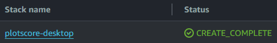
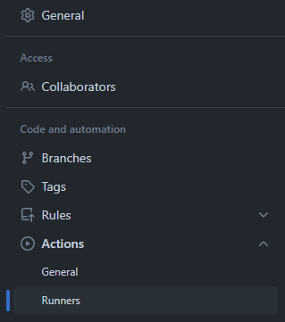
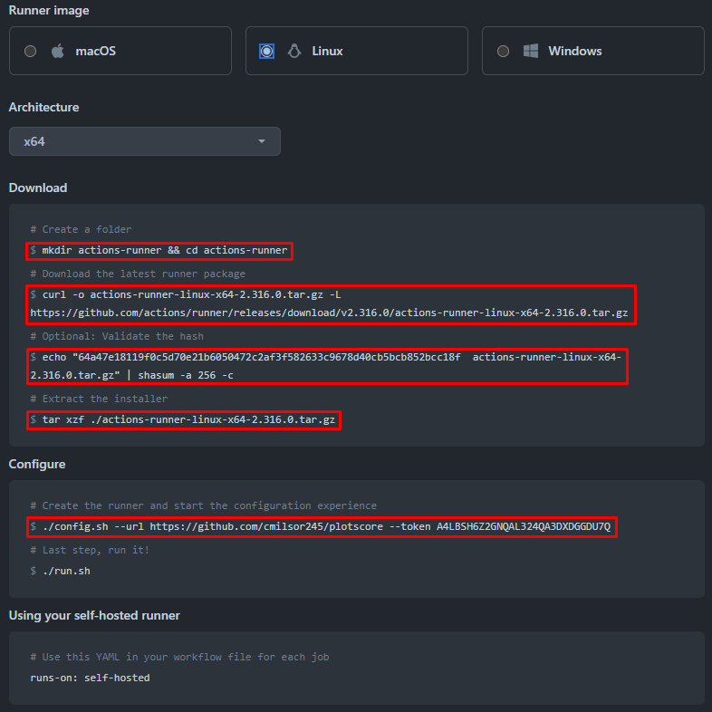
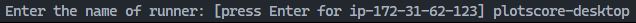
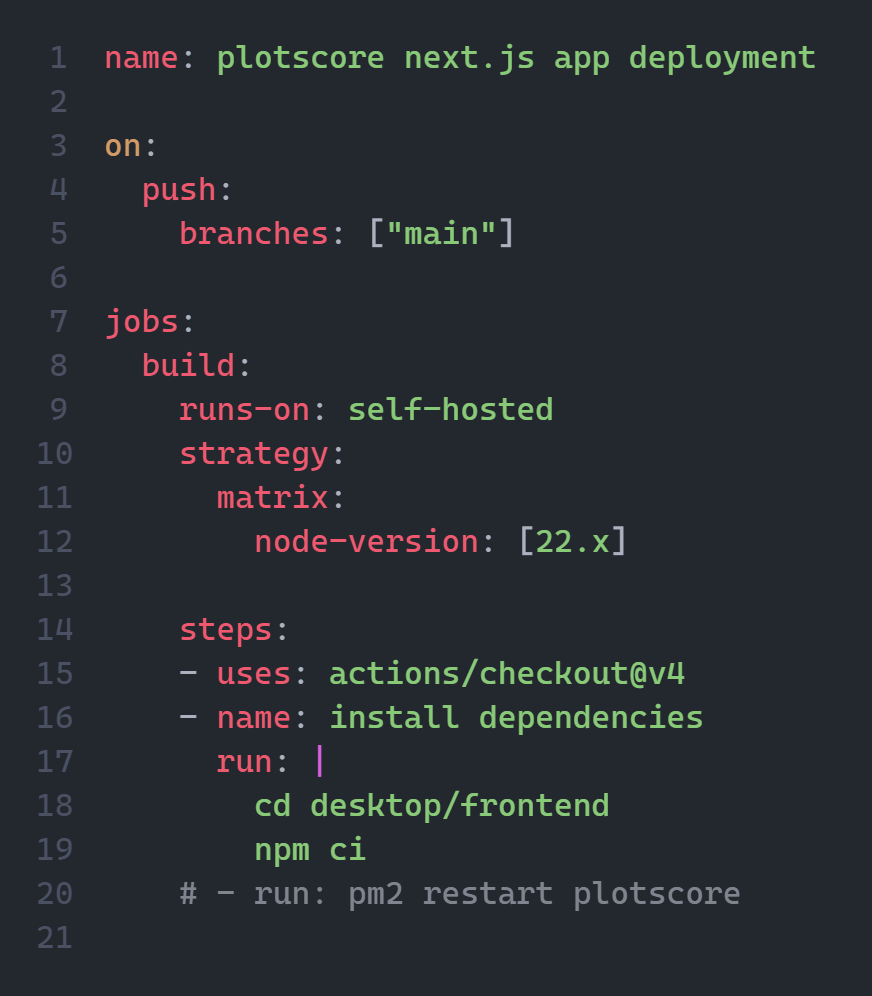
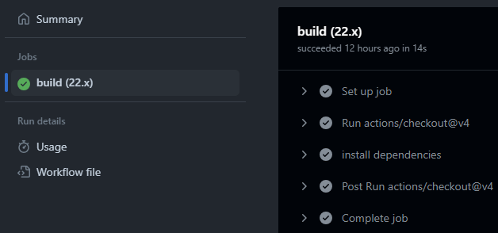
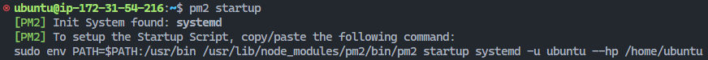
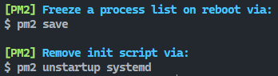

# CI/CD pipeline for **plotscore** Next.js project

## Table of contents

1. [AWS EC2 instance creation](#aws-ec2-instance-creation)
2. [GitHub repository setup](#github-repository-setup)
3. [Setting up GitHub Actions Runner and Workflow](#setting-up-github-actions-runner-and-workflow)
4. [Running Next.js project in background](#running-nextjs-project-in-background)
5. [Updating GitHub Actions Workflow](#updating-github-actions-workflow)
6. [Access the site](#access-the-site)
7. [Automatically deploying after reboot](#automatically-deploying-after-reboot)

### AWS EC2 instance creation

The first step is to create a **new EC2 instance** which will host the new Next.js project.

In order to have a production ready environment, it is recommended to use an **AWS Cloudformation template** to make sure everything is correctly configured once the new instance is launched.

[Here](https://github.com/cmilsor245/plotscore/blob/main/.aws/cloudformation.yml)'s the template that is used to create the instance for the `plotscore` project. As seen in the file, **Node.js 22.x** is installed, as well as the **latest version of npm**. Also, a new **Security Group** and an **Elastic IP Address** are created and assigned to the brand new instance.

We can use the template to create a **new AWS Stack** which automatically generates all these resources and configurations.

#### [Back to top](#cicd-pipeline-for-plotscore-nextjs-project)

### GitHub repository setup

Next thing in the list is creating the **new Next.js project** and pushing it to the repository we are using to host the code of the project/s on GitHub.

Based on the [requirements of this project](https://github.com/CPIFPAlanTuring/2daw-tfc-2324), the two different versions of the website need to be hosted on the **same GitHub repository**, therefore we organized them in two different directories.

We created a directory for `desktop-version` and another one for `mobile-version`. Inside each directory there's the **frontend and backend sides of each project separated from each other** for clarity.

Then, we **push the new project files to the repo** for the first time to wrap up  this step.

#### [Back to top](#cicd-pipeline-for-plotscore-nextjs-project)

### Setting up GitHub Actions Runner and Workflow

Once we have our project on our GitHub repository, we need to create an automatic process that will make sure every time there's a new push to the repo with any changes, we will trigger a new deployment process.

For this, we create a **new GitHub Actions Runner**.

Inside this tab we click on the `New self-hosted runner` button to create a new one. We now have to choose a Linux image for our runner, given that our EC2 instance is running in an Ubuntu Server, and now we need to **execute the following highlighted commands** in our terminal on the EC2 instance:

Once we execute the last highlighted command, GitHub asks us some questions about the name of the new runner and similar queries. We specify a **custom name for the new runner** and leave the rest as default.

Finally, the only commands that remain are `sudo ./svc.sh install` and `sudo ./svc.sh start` to have the new runner running in **Idle** mode, waiting for any GitHub Actions Workflow to be triggered.

Now we head to our local files, to the root directory of our repository in our local machine, and create the next file: `.github/workflows/deploy.yml`.

Inside this file, we are creating a new GitHub trigger. We will use the `push` event to trigger the deployment process. The content of this new file is located [here](https://github.com/cmilsor245/plotscore/blob/main/.github/workflows/deploy.yml).

> [!IMPORTANT]
> Please note that, in order to not cause any errors when deploying the project for the first time to our EC2 instance, it's crucial to **comment the last command** like so:

Now we can create a now commit with these changes and push them to the repo. Then, we can visit the **Actions tab** inside our repository and watch the deployment process happening in our EC2 instance.

While this process is running, the GitHub Actions Runner will switch to **Active** mode.

#### [Back to top](#cicd-pipeline-for-plotscore-nextjs-project)

### Running Next.js project in background

Usually, if a Next.js app is running in a terminal, it's not possible to close said terminal. We need the production deployment to happen in the background in order to be able to access the site while not being locked in the terminal.

To do this, we need to install `PM2`, which is a process manager that will manage our Next.js process in the background.

To install it, we first need to change our active directory inside the EC2 instance to the root directory of our Next.js project:

`cd ~/actions-runner/_work/plotscore/plotscore/desktop/frontend/`

Then, we execute the following command:

`sudo npm i -g pm2`

And finally, we execute the following command, which will create a background process that will firstly run the **build** script to compile our project and the the **start** script to generate a production accessible version of our Next.js project:

`pm2 start "npm run build && npm run start" --name=plotscore`

#### [Back to top](#cicd-pipeline-for-plotscore-nextjs-project)

### Updating GitHub Actions Workflow

Now we have to come back to our local Github Actions Workflow file and remove the comment from the last command. This will make GitHub execute a restart action to apply the changes with our background process called `plotscore`.

This process will run a build and start script once again and apply the changes to our Next.js production version.

#### [Back to top](#cicd-pipeline-for-plotscore-nextjs-project)

### Access the site

We can now gather the **Public IP Address** of our EC2 instance and access the site specifying this IP address in the browser followed by the **port 3000**.

By default, the AWS Cloudformation template sets up an inbound rule for our Security Group to allow access to our machine through port 3000. This may come in handy when deploying the project and taking the first steps, but it may be a good idea to change this rule in the future by deleting it and configuring our instance to serve the project on **port 80** or **port 443**, which are the referred ports for **HTTP** and **HTTPS**.

#### [Back to top](#cicd-pipeline-for-plotscore-nextjs-project)

### Automatically deploying after reboot

Due to our AWS plan, the AWS Lab shuts down every 4 hours. This causes the production deployment to be stopped after 4 hours. To fix this issue, we need to **automate the deployment process after every reboot** of our machine.

To achieve that we are going to execute some commands to establish PM2 **as a service**.

Firstly, with the command `pm2 list` we'll get to see a full list of processes created by us running in the background. As of now, we only have **one**, called **plotscore**.

After that, we can use the command `pm2 save` to save said list.

The next step involves initiating PM2 as a service using the command `pm2 startup`. This command generates an additional command necessary for configuring the script to ensure PM2 runs as a service automatically upon every EC2 instance startup.

#### [Back to top](#cicd-pipeline-for-plotscore-nextjs-project)
