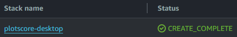
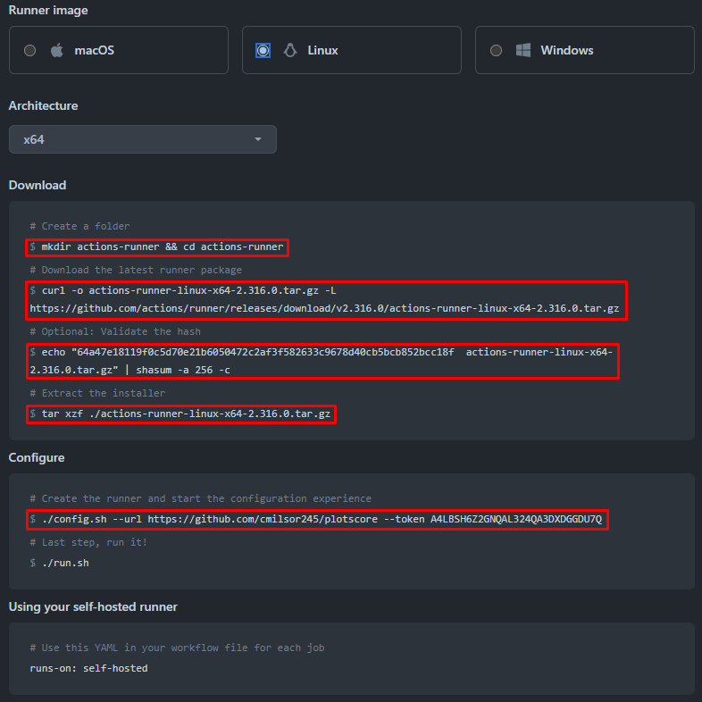
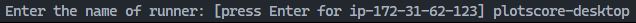
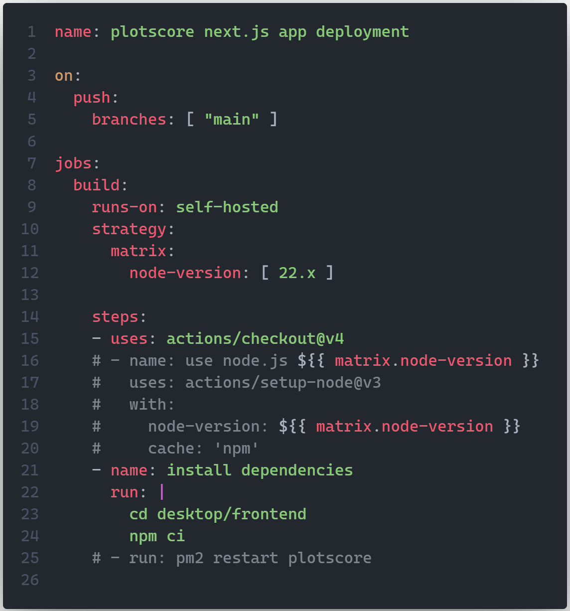
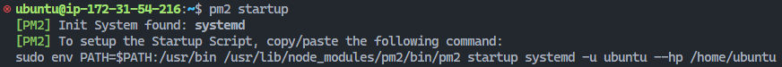

# Pipeline CI/CD para el proyecto de **plotscore** en Next.js

## Índice

1. [Creación de instancia AWS EC2](#creación-de-instancia-aws-ec2)
2. [Configuración del repositorio GitHub](#configuración-del-repositorio-github)
3. [Configuración del Runner y Flujo de Trabajo de GitHub Actions](#configuración-del-runner-y-flujo-de-trabajo-de-github-actions)
4. [Ejecución del proyecto Next.js en segundo plano](#ejecución-del-proyecto-nextjs-en-segundo-plano)
5. [Actualización del Flujo de Trabajo de GitHub Actions](#actualización-del-flujo-de-trabajo-de-github-actions)
6. [Acceso al sitio](#acceso-al-sitio)
7. [Automatización del despliegue tras reinicio](#automatización-del-despliegue-tras-reinicio)

### Creación de instancia AWS EC2

El primer paso es crear una **nueva instancia EC2** que alojará el nuevo proyecto en Next.js.

Para tener un entorno listo para producción, se recomienda utilizar una **plantilla de AWS CloudFormation** para asegurarse de que todo esté configurado correctamente una vez que se lance la nueva instancia.

[Aquí](https://github.com/cmilsor245/plotscore/blob/main/.aws/cloudformation.yml) está la plantilla que se utiliza para crear la instancia para el proyecto `plotscore`. Como se ve en el archivo, se instala **Node.js 22.x**, así como la **última versión de npm**. Además, se crea un nuevo **Grupo de Seguridad** y se asigna una **Dirección IP Elástica** a la nueva instancia.

Podemos usar la plantilla para crear una **nueva Pila AWS** que genere automáticamente todos estos recursos y configuraciones.

#### [Volver arriba](#pipeline-cicd-para-el-proyecto-nextjs-plotscore)

### Configuración del repositorio GitHub

Lo siguiente en la lista es crear el **nuevo proyecto Next.js** y enviarlo al repositorio que estamos utilizando para alojar el código del proyecto o proyectos en GitHub.

Basándonos en los [requisitos de este proyecto](https://github.com/CPIFPAlanTuring/2daw-tfc-2324), las dos versiones diferentes del sitio web deben alojarse en el **mismo repositorio de GitHub**, por lo tanto, los organizamos en dos directorios diferentes.

Creamos un directorio para la `versión de escritorio` y otro para la `versión móvil`. Dentro de cada directorio hay **partes del frontend y backend de cada proyecto separadas entre sí** para mayor claridad.

Luego, **hacemos push de los archivos del nuevo proyecto al repositorio** por primera vez para completar este paso.

#### [Volver arriba](#pipeline-cicd-para-el-proyecto-nextjs-plotscore)

### Configuración del Runner y Flujo de Trabajo de GitHub Actions

Una vez que tenemos nuestro proyecto en el repositorio de GitHub, necesitamos crear un proceso automático que se asegure de que cada vez que haya un nuevo push al repositorio, se desencadene un nuevo proceso de implementación.

Para esto, creamos un **nuevo Runner de GitHub Actions**.

Dentro de esta pestaña, hacemos clic en el botón `New self-hosted runner` para crear uno nuevo. Ahora tenemos que elegir una imagen de Linux para nuestro runner, dado que nuestra instancia EC2 está ejecutando Ubuntu Server, y ahora necesitamos **ejecutar los siguientes comandos resaltados** en nuestra terminal en la instancia EC2:

Una vez que ejecutamos el último comando señalado, GitHub nos hace algunas preguntas sobre el nombre del nuevo runner y consultas similares. Especificamos un **nombre personalizado para el nuevo runner** y dejamos el resto como predeterminado.

Finalmente, los únicos comandos que quedan son `sudo ./svc.sh install` y `sudo ./svc.sh start` para tener el nuevo runner en modo **Idle**, esperando que se active cualquier Flujo de Trabajo de GitHub Actions.

Ahora nos dirigimos a nuestros archivos locales, al directorio raíz de nuestro repositorio en nuestra máquina local, y creamos el siguiente archivo: `.github/workflows/deploy.yml`.

Dentro de este archivo, estamos creando un nuevo trigger de GitHub. Usaremos el evento `push` para desencadenar el proceso de implementación. El contenido de este nuevo archivo se encuentra [aquí](https://github.com/cmilsor245/plotscore/blob/main/.github/workflows/deploy.yml).

> [!IMPORTANT]
> Hay que tener en cuenta que, para no causar ningún error al implementar el proyecto por primera vez en nuestra instancia EC2, es crucial **comentar el último comando** de esta manera:

Ahora podemos crear un nuevo commit con estos cambios y enviarlos al repositorio. Luego, podemos visitar la pestaña **Actions** dentro de nuestro repositorio y observar el proceso de implementación que ocurre en nuestra instancia EC2.

Mientras este proceso se está ejecutando, el Runner de GitHub Actions cambiará a **Active**.

#### [Volver arriba](#pipeline-cicd-para-el-proyecto-nextjs-plotscore)

### Ejecución del proyecto Next.js en segundo plano

Por lo general, si un proyecto Next.js se está ejecutando en un terminal, no es posible cerrar dicho terminal. Necesitamos que la implementación en producción ocurra en segundo plano para poder acceder al sitio sin estar bloqueados en el terminal.

Para hacer esto, necesitamos instalar `PM2`, que es un gestor de procesos que administrará nuestro proceso Next.js en segundo plano.

Para instalarlo, primero necesitamos cambiar nuestro directorio activo dentro de la instancia EC2 al directorio raíz de nuestro proyecto Next.js:

`cd ~/actions-runner/_work/plotscore/plotscore/desktop/frontend/`

Luego, ejecutamos el siguiente comando:

`sudo npm i -g pm2`

Y finalmente, ejecutamos el siguiente comando, que creará un proceso en segundo plano que primero ejecutará el **script de compilación** para compilar nuestro proyecto y luego el **script de inicio** para generar una versión de producción accesible de nuestro proyecto Next.js:

`pm2 start "npm run build && npm run start" --name=plotscore`

#### [Volver arriba](#pipeline-cicd-para-el-proyecto-nextjs-plotscore)

### Actualización del Flujo de Trabajo de GitHub Actions

Ahora tenemos que volver a nuestro archivo local de Flujo de Trabajo de GitHub Actions y quitar el comentario del último comando. Esto hará que GitHub ejecute una acción de reinicio para aplicar los cambios con nuestro proceso en segundo plano llamado `plotscore`.

Este proceso ejecutará nuevamente un script de compilación y de inicio y aplicará los cambios a nuestra versión de producción de Next.js.

#### [Volver arriba](#pipeline-cicd-para-el-proyecto-nextjs-plotscore)

### Acceso al sitio

Ahora podemos obtener la **Dirección IP Pública** de nuestra instancia EC2 y acceder al sitio especificando esta dirección IP en el navegador seguida del **puerto 3000**.

Por defecto, la plantilla de AWS CloudFormation establece una regla de entrada para nuestro Grupo de Seguridad para permitir el acceso a nuestra máquina a través del puerto 3000. Esto puede ser útil al implementar el proyecto y dar los primeros pasos, pero puede ser buena idea cambiar esta regla en el futuro eliminándola y configurando nuestra instancia para servir el proyecto en el **puerto 80** o el **puerto 443**, que son los puertos referidos para **HTTP** y **HTTPS**.

#### [Volver arriba](#pipeline-cicd-para-el-proyecto-nextjs-plotscore)

### Automatización del despliegue tras reinicio

Debido a la configuración de nuestro plan en AWS, el AWS Lab se apaga automáticamente cada 4 horas de uso. Esto causará que la implementación de la aplicación se detenga tras 4 horas de uso. Para solucionar este problema, necesitamos **automatizar el despliegue tras reinicio** de nuestra máquina.

Para conseguir esto vamos a ejecutar una serie de comandos para establecer a PM2 **como un servicio**.

Primeramente, con el comando `pm2 list` podemos ver todos los procesos que estén en corriendo segundo plano. Por el momento solo tenemos **un proceso**, llamado **plotscore**.

Después de esto, podemos usar el comando `pm2 save` para guardar dicha lista.

El siguiente paso es iniciar PM2 como un servicio, lo cual conseguiremos con el comando `pm2 startup`. Este comando genera a su vez otro comando que deberemos ejecutar para configurar el script que se encargará de ejecutar PM2 como un servicio de forma automática cada vez que se encienda la instancia EC2.

#### [Volver arriba](#pipeline-cicd-para-el-proyecto-nextjs-plotscore)
