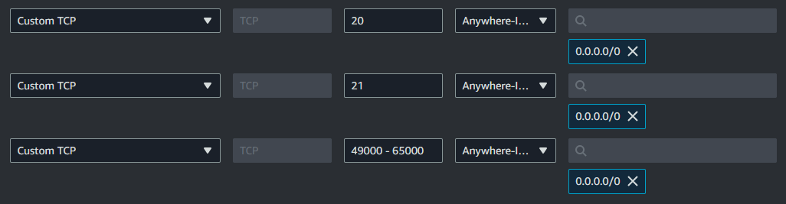
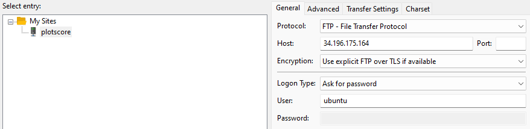
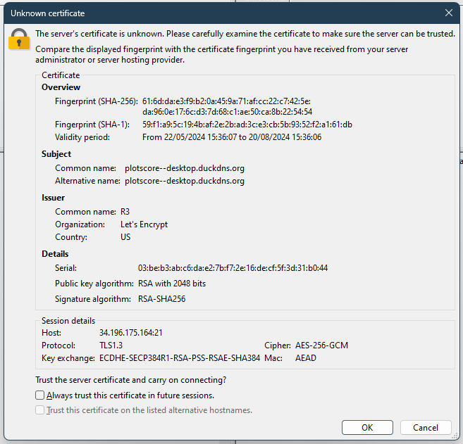

# Installing and securing a FTP server

# [:us: English](#english) | [:es: Español](#español)

## English

### Table of contents

1. [Installing FTP server](#installing-ftp-server)
2. [Setting up FTP server configuration](#setting-up-ftp-server-configuration)
3. [EC2 instance Firewall rules](#ec2-instance-firewall-rules)
4. [Local connection through FileZilla](#local-connection-through-filezilla)
5. [Securing FTP server](#securing-ftp-server)

#### [Back to top](#installing-and-securing-a-ftp-server)

### Installing FTP server

The first step is updating your EC2 instance with the next command: `sudo apt update -y && sudo apt upgrade -y && sudo apt auto-remove -y`.

You now need to switch to the **root** user using the `sudo su` command and install the **proftpd** package with the following command: `sudo apt install proftpd -y`.

#### [Back to english section](#english)

---

### Setting up FTP server configuration

By executing the command `sudo nano /etc/proftpd/proftpd.conf` you can edit the following configuration:

Look for the line `PassivePorts`, remove the line comment and set it's value to `49000 65000`.

Now set the line starting with `MasqueradeAddress` to your EC2 instance's public IP. Remove it's line comment too.

Save the changes, exit the file and execute `sudo systemctl restart proftpd` to restart the server and apply said changes.

#### [Back to english section](#english)

---

### EC2 instance Firewall rules

You now need to head to the EC2 instance's control panel in AWS. Once you have done that, you can open the **Security** tab, click on the one Security Group that is linked to this machine and click on the **Edit inbound rules** button to add the following rules:



Save this configuration.

#### [Back to english section](#english)

---

### Local connection through FileZilla

Before connecting to this new server locally, you need to set a new password for the **ubuntu** user in EC2 by executing the following command: `sudo passwd ubuntu`.

You can now connect to your EC2 instance using **FileZilla**, setting the next configuration for a new site:



#### [Back to english section](#english)

---

### Securing FTP server

Final step consists in making this existing connection secure by using **TLS**. To get to that point, you first have to check that proftpd is enabling the TLS feature by executing the following command: `sudo nano /etc/proftpd/modules.conf`. Look for the line with the following content and remove the line comment (if it exists) `LoadModule mod_tls.c`. Save the changes, exit the file and execute `sudo systemctl restart proftpd` to restart the server and apply this change.

Edit the file `/etc/proftpd/proftpd.conf` using the `sudo nano /etc/proftpd/proftpd.conf` and enable the `Include /etc/proftpd/tls.conf` by removing it's line comment. Also, get to the end of the file and add the following line: `TLSOptions  NoSessionReuseRequired`. Save and apply the changes by restarting the server with `sudo systemctl restart proftpd`.

Finally, execute `sudo nano /etc/proftpd/tls.conf` and add the following lines inside the `<IfModule mod_tls.c>` block:

```bash
TLSEngine                     on
TLSLog                        /var/log/proftpd/tls.log
TLSProtocol                   SSLv23

TLSRSACertificateFile         /etc/letsencrypt/live/plotscore--desktop.duckdns.org/fullchain.pem
TLSRSACertificateKeyFile      /etc/letsencrypt/live/plotscore--desktop.duckdns.org/privkey.pem

TLSRequired                   on
```

Save and apply the changes by restarting the server with `sudo systemctl restart proftpd`. Now your server is secured, which can be tested by establishing a new connection in FileZilla.



#### [Back to english section](#english)

---

---

## Español

### Índice

1. [Instalación del servidor FTP](#instalación-del-servidor-ftp)
2. [Configuración del servidor FTP](#configuración-del-servidor-ftp)
3. [Reglas de Firewall de la instancia EC2](#reglas-de-firewall-de-la-instancia-ec2)
4. [Conexión local a traves de FileZilla](#conexión-local-a-traves-de-filezilla)
5. [Securizando el servidor FTP](#securizando-el-servidor-ftp)

#### [Volver arriba](#installing-and-securing-a-ftp-server)

### Instalación del servidor FTP

El primer paso es actualizar la instancia EC2 con la siguiente instrucción: `sudo apt update -y && sudo apt upgrade -y && sudo apt auto-remove -y`.

Ahora necesitas iniciar sesión como **root** usando el comando `sudo su` y instalar el **proftpd** con la siguiente instrucción: `sudo apt install proftpd -y`.

#### [Volver a la sección en español](#español)

---

### Configuración del servidor FTP

Ejecutando el comando `sudo nano /etc/proftpd/tls.conf` puedes editar la siguiente configuración:

Busca la línea `PassivePorts`, elimina el comentario de la línea y establece el valor en `49000 65000`.

Ahora establece el valor de la línea `MasqueradeAddress` en la IP publica de tu instancia EC2. Elimina el comentario de la línea.

Guarda y aplica los cambios con `sudo systemctl restart proftpd`.

#### [Volver a la sección en Español](#español)

---

### Reglas de Firewall de la instancia EC2

Lo siguiente es dirigirte al panel de control de la instancia EC2 en AWS. Luego, abre la pestaña **Seguridad** y haz clic en la **Editar reglas de entrada** para agregar las siguientes reglas:


Guarda esta configuración.

#### [Volver a la sección en Español](#español)

---

### Conexión local a traves de FileZilla

Antes de conectarte al servidor localmente, debes establecer una nueva contraseña para el **ubuntu** usuario en la instancia EC2 ejecutando el siguiente comando: `sudo passwd ubuntu`.

Ahora puedes conectarte a tu instancia EC2 usando **FileZilla**, estableciendo la siguiente configuración para un nuevo sitio:


#### [Volver a la sección en Español](#español)

---

### Securizando el servidor FTP

El último paso consiste en convertir esta conexión en una conexión segura haciendo uso de **TLS**. Para llegar a ese punto, primero tienes que comprobar que el servidor proftpd esta habilitando la característica TLS ejecutando el comando `sudo nano /etc/proftpd/modules.conf`. Busca la línea con el siguiente contenido y elimina el comentario del principio de la misma (si existo dicho comentario): `LoadModule mod_tls.c`. Guarda los cambios y sale del archivo y ejecuta `sudo systemctl restart proftpd` para reiniciar el servidor y aplicar este cambio.

Edita el archivo `/etc/proftpd/proftpd.conf` con el comando `sudo nano /etc/proftpd/proftpd.conf` y habilita la línea `Include /etc/proftpd/tls.conf` quitando el comentario de la misma. Además, dirígete al final del archivo y agrega la línea `TLSOptions  NoSessionReuseRequired`. Guarda y aplica los cambios con `sudo systemctl restart proftpd`.

Finalmente, ejecuta `sudo nano /etc/proftpd/tls.conf` y agrega las siguientes lineas dentro del bloque `<IfModule mod_tls.c>`:

```bash
TLSEngine                     on
TLSLog                        /var/log/proftpd/tls.log
TLSProtocol                   SSLv23

TLSRSACertificateFile         /etc/letsencrypt/live/plotscore--desktop.duckdns.org/fullchain.pem
TLSRSACertificateKeyFile      /etc/letsencrypt/live/plotscore--desktop.duckdns.org/privkey.pem

TLSRequired                   on
```

Guarda y aplica los cambios con `sudo systemctl restart proftpd`. Ahora tu servidor está protegido, el cual puede ser probado ejecutando una nueva conexión en FileZilla.


#### [Volver a la sección en Español](#español)
