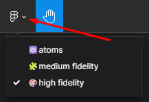

# plotscore

# [:us: English](#english) | [:es: Español](#español)

## English

I've created a permanent deployment using ***Vercel*** just so everyone can visit the actual production version of the **desktop version** and the **mobile version** of the **plotscore** project in any moment without having to turn on the AWS EC2 instances.

- [Desktop version permanent link](https://plotscore--desktop.vercel.app/)
- [Mobile version permanent link](https://plotscore--mobile.vercel.app/)

### Table of contents

1. [TODO list](#todo-list)
2. [General documentation](#general-documentation)
3. [Final check video](#final-check-video)
4. [Checkpoint video](#checkpoint-video)
5. [Notion page](#notion-page)
6. [Figma designs](#figma-designs)
7. [Swagger documentation](#swagger-documentation)
8. [Desktop version CI/CD pipeline guide](#desktop-version-cicd-pipeline-guide)
9. [Secure FTP server installation and configuration guide](#secure-ftp-server-installation-and-configuration-guide)

#### [Back to top](#plotscore)

### TODO list

- :red_circle: :point_right: Not done yet
- :yellow_circle: :point_right: Currently in process
- :green_circle: :point_right: Already completed

#### Anteproyecto

- [x] :green_circle: Notion page

#### Design

- [x] :green_circle: **Desktop version** Figma design
- [x] :green_circle: **Mobile version** Figma design

#### Frontend

- [ ] :yellow_circle: Frontend side of the **desktop version**
- [x] :green_circle: Frontend side of the **mobile version**

#### Backend

- [ ] :yellow_circle: Backend side of the **desktop version**

#### Deployment

- [x] :green_circle: Deployment of the **desktop version** using AWS EC2
- [x] :green_circle: Automatic deployment process for the **desktop version** (frontend)
- [x] :green_circle: Automatic deployment process for the **desktop version** (backend)
- [x] :green_circle: Deployment of the **mobile version** using an AWS EC2 instance
- [x] :green_circle: Automatic deployment process for the **mobile version** (frontend)
- [x] :green_circle: Creating a **custom domain** for the desktop version :arrow_right: [Link](https://plotscore--desktop.duckdns.org/)
- [x] :green_circle: Creating a **custom domain** for the **mobile version** :arrow_right: [Link](https://plotscore--mobile.duckdns.org/)
- [x] :green_circle: Enabling **HTTPS** connections to the **desktop version**
- [x] :green_circle: Enabling **HTTPS** connections to the **mobile version**
- [x] :green_circle: Installing a **secure FTP server** for the **desktop version**
- [x] :green_circle: Installing a **secure FTP server** for the **mobile version**

##### [Back to TODO list section](#todo-list)

#### [Back to english section](#english)

---

### General documentation

Click [here](https://christian-millan-soria.notion.site/plotscore-documentation-9d6a1b30f96d4efa8e1ef500fea2c8f4) to access the general documentation.

#### [Back to english section](#english)

---

### Final check video

Click [here](https://youtu.be/c47qdKnAKzw) to watch the final check video.

#### [Back to english section](#english)

---

### Checkpoint video

Click [here](https://youtu.be/hsr6cpZhtYg) to watch the checkpoint video.

#### [Back to english section](#english)

---

### Notion page

Click [here](https://christian-millan-soria.notion.site/plotscore-7b99f56524704e96b75dc91d74cd3039) to access the corresponding Notion page.

#### [Back to english section](#english)

---

### Figma designs

Click [here](https://www.figma.com/file/n4SCBhfrSxQZoQCxgk3bT0/plotscore---desktop-version?type=design&node-id=496%3A206&mode=design&t=YNZIFAdL6cYdkgz7-1) to visit the project's (**desktop version**) design on **Figma**.

Click [here](https://www.figma.com/design/N8xTc8yxVCcaegtkZLZu4O/plotscore---mobile-version?node-id=3001-13617&t=BMGg0CgqVIycPO6J-1) to visit the project's (**mobile version**) design on **Figma**.

It is recommended to use the **playground mode** to be able to actually interact with the pages navigation or the components throughout the design.

It is possible to **navigate through the atoms and different fidelities** by **clicking on the top-left icon**:

#### [Back to english section](#english)

---

### Swagger documentation

Click [here](https://app.swaggerhub.com/apis/A2019CF1CMILLAN/plotscore/1.0.0) to access the Swagger documentation.

Click [here](https://github.com/cmilsor245/plotscore/blob/main/desktop/backend/doc/swagger.yml) to access the YAML Swagger file.

#### [Back to english section](#english)

---

### Desktop version CI/CD pipeline guide

Click [here](https://github.com/cmilsor245/plotscore/blob/main/.aws/ci-cd--guide--desktop/README.md) to access the desktop version CI/CD pipeline guide.

#### [Back to english section](#english)

---

### Secure FTP server installation and configuration guide

Click [here](https://github.com/cmilsor245/plotscore/blob/main/.ftp/secure-ftp-guide/README.md) to access the secure FTP server installation and configuration guide.

#### [Back to english section](#english)

---

---

## Español

He creado un despliegue permanente haciendo uso de ***Vercel*** para que cualquiera pueda visitar la versión de producción de la **versión desktop** y la **versión mobile** de **plotscore** en cualquier momento sin necesidad de que las máquinas de AWS EC2 estén encendidas.

- [Link a la versión desktop](https://plotscore--desktop.vercel.app/)
- [Link a la versión mobile](https://plotscore--mobile.vercel.app/)

### Índice

1. [Lista de tareas pendientes](#lista-de-tareas-pendientes)
2. [Documentación general](#documentación-general)
3. [Vídeo checkpoint final](#vídeo-checkpoint-final)
4. [Vídeo del checkpoint](#vídeo-del-checkpoint)
5. [Notion](#notion)
6. [Diseños en Figma](#diseños-en-figma)
7. [Documentación Swagger](#documentación-swagger)
8. [Guía CI/CD pipeline para la versión desktop](#guía-cicd-pipeline-para-la-versión-desktop)
9. [Guía para la instalación y configuración de un servidor FTP seguro](#guía-para-la-instalación-y-configuración-de-un-servidor-ftp-seguro)

#### [Volver arriba](#plotscore)

### Lista de tareas pendientes

- :red_circle: :point_right: Pendiente
- :yellow_circle: :point_right: En proceso en este momento
- :green_circle: :point_right: Completado

#### Anteproyecto

- [x] :green_circle: Notion con información inicial del proyecto

#### Diseño

- [x] :green_circle: Diseño en Figma de la **versión desktop**
- [x] :green_circle: Diseño en Figma de la **versión mobile**

#### Frontend

- [ ] :yellow_circle: Parte frontend de la **versión desktop**
- [x] :green_circle: Parte frontend de la **versión mobile**

#### Backend

- [ ] :yellow_circle: Parte backend de la **versión desktop**

#### Despliegue

- [x] :green_circle: Despliegue de la **versión desktop** haciendo uso de una AWS EC2
- [x] :green_circle: Proceso de despliegue automático para la **versión desktop** (frontend)
- [x] :green_circle: Proceso de despliegue automático para la **versión desktop** (backend)
- [x] :green_circle: Despliegue de la **versión mobile** haciendo uso de una AWS EC2
- [x] :green_circle: Proceso de despliegue automático para la **versión mobile** (frontend)
- [x] :green_circle: Crear un **dominio personalizado** para la **versión desktop** :arrow_right: [Link](https://plotscore--desktop.duckdns.org/)
- [x] :green_circle: Crear un **dominio personalizado** para la **versión mobile** :arrow_right: [Link](https://plotscore--mobile.duckdns.org/)
- [x] :green_circle: Habilitando conexiones **HTTPS** hacia la **versión desktop**
- [x] :green_circle: Habilitando conexiones **HTTPS** hacia la **versión mobile**
- [x] :green_circle: Instalando un **servidor seguro FTP** para la **versión desktop**
- [x] :green_circle: Instalando un **servidor seguro FTP** para la **versión mobile**

##### [Volver a la sección de Lista de tareas pendientes](#lista-de-tareas-pendientes)

#### [Volver a la sección en español](#español)

---

### Documentación general

Haz clic [aquí](https://christian-millan-soria.notion.site/plotscore-documentaci-n-ce084f7198734b02920f9ea21043234d) para acceder a la documentación general.

#### [Volver a la sección en Español](#español)

---

### Vídeo checkpoint final

Haz clic [aquí](https://youtu.be/c47qdKnAKzw) para ver el video final del checkpoint.

#### [Volver a la sección en Español](#español)

---

### Vídeo del checkpoint

Haz clic [aquí](https://youtu.be/hsr6cpZhtYg) para ver el video del checkpoint.

#### [Volver a la sección en español](#español)

---

### Notion

Haz clic [aquí](https://christian-millan-soria.notion.site/plotscore-93a62f5a1acf4c7289b809359ff0ccff) para acceder al Notion correspondiente al proyecto.

#### [Volver a la sección en español](#español)

---

### Diseños en Figma

Haz clic [aquí](https://www.figma.com/file/n4SCBhfrSxQZoQCxgk3bT0/plotscore---desktop-version?type=design&node-id=496%3A206&mode=design&t=YNZIFAdL6cYdkgz7-1) para visitar el diseño del proyecto (**versión desktop**) en **Figma**.

Haz clic [aquí](https://www.figma.com/design/N8xTc8yxVCcaegtkZLZu4O/plotscore---mobile-version?node-id=3001-13617&t=BMGg0CgqVIycPO6J-1) para visitar el diseño del proyecto (**versión mobile**) en **Figma**.

Se recomienda entrar en el **modo playground** para poder interactuar con la navegación entre páginas y los componentes de forma dinámica.

Es posible **navegar entre los átomos y las diferentes fidelidades del proyecto** utilizando el **desplegable de la esquina superior izquierda**:

#### [Volver a la sección en español](#español)

---

### Documentación Swagger

Haz clic [aquí](https://app.swaggerhub.com/apis/A2019CF1CMILLAN/plotscore/1.0.0) para acceder a la documentación Swagger.

Haz clic [aquí](https://github.com/cmilsor245/plotscore/blob/main/desktop/backend/doc/swagger.yml) para acceder al archivo YAML de Swagger.

---

### Guía CI/CD pipeline para la versión desktop

Haz clic [aquí](https://github.com/cmilsor245/plotscore/blob/main/.aws/ci-cd--guide--desktop/README.md) para acceder a la guía del CI/CD pipeline para la **versión desktop**.

#### [Volver a la sección en Español](#español)

---

### Guía para la instalación y configuración de un servidor FTP seguro

Haz clic [aquí](https://github.com/cmilsor245/plotscore/blob/main/.ftp/secure-ftp-guide/README.md) para acceder a la guía del servidor FTP seguro seguro.

#### [Volver a la sección en Español](#español)
